# Experimental Notes

## Prototype Builds

## Gate Drive Experiments

The critical part of the design is related to driving the IGBT gate with the correct voltage. Note the turn-on voltage is higher than with a MOSFET,
but we still have the sensitivity to "too high" a gate voltage causing punch-through.

* Proto rev2 "initial": 00000: Gate drive (measured on pins of package), using PDZ10B + 10 ohm series on T2 output. No shunt resistor (R9):

   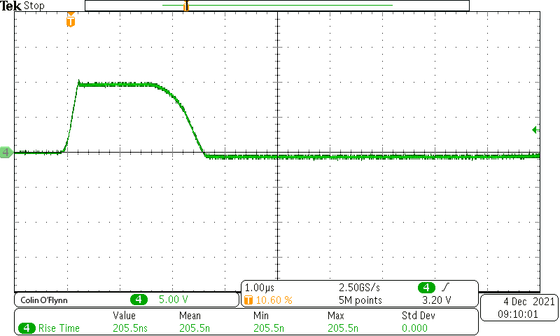

* Proto rev2 "initial": 00001: Output at 4mm coil (across coil) using above drive:

   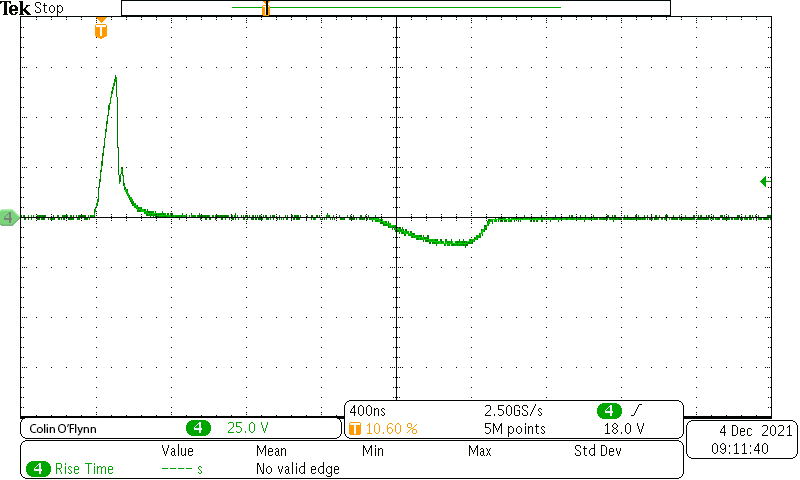

* Proto rev2 "initial": 00002: Output to resistor test jig using above drive:

   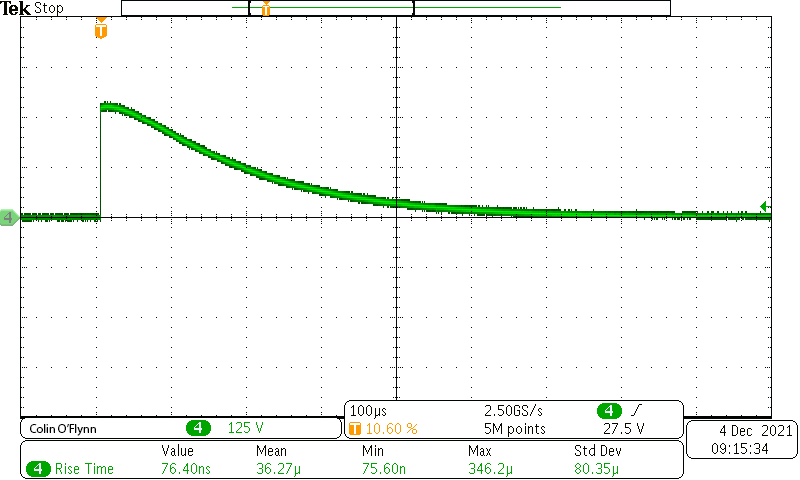

At this point I removed the TVS. I discovered the main "spike" was the wrong polarity, so I swapped the transformer pins with a PCB mod. This swapped
pin orientation is how the rest of the design was done, and I refer to this now as "Proto rev2". This is the same polarity as in the final schematic.
Previously with the diode present it shunted the negative spike so I never saw this issue.

* Proto rev2: 00003: Gate drive (measured on pins of package), using NO TVS (D7), 10 ohm series (R7), 2k shunt resistor (R9):

   

* Proto rev2: 00004: Output to resistor test jig using above drive:

   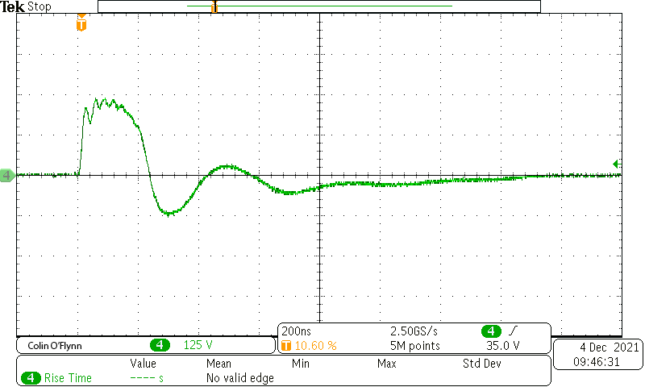

* Proto rev2: 00005: Output to 4mm coil using above drive:

   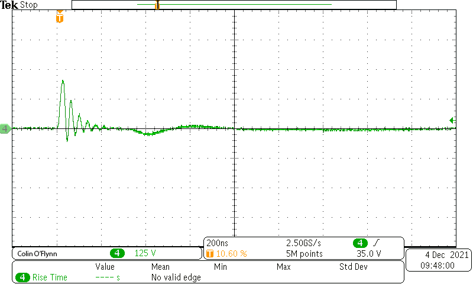

   Note carefully the difference between "00001" - the scales on 00001 are smaller, so you can see a much smaller pulse delivered to the coil. This suggests that
   we've got a winning design here! It also seemed to cause more 'useful' FI effects.

* Proto rev2: 00006: Gate drive (measured on pins of package), using PDZ10B + 10 ohm series on T2 output, 2k shunt resistor (R9):

    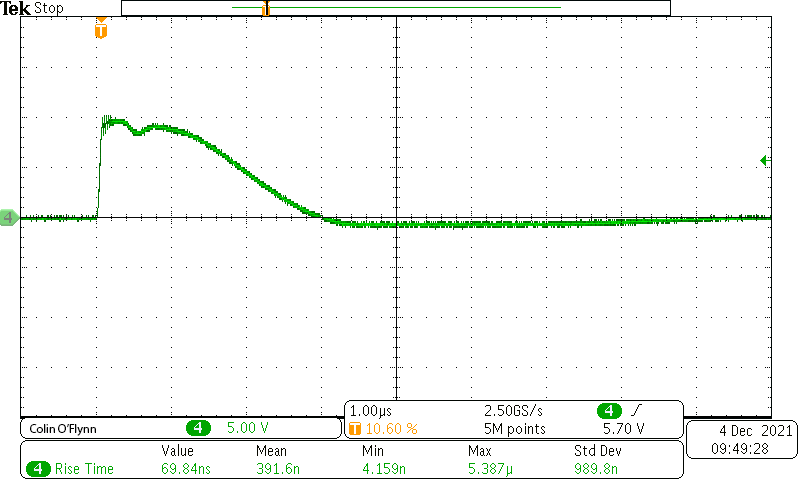

* Proto rev3: 00007/8: Gate drive (measured on pins of package), using 10 ohm series on T2 output, 2k shunt resistor. C5 present (initial build):

   

* Proto rev3: 00009: Gate drive (measured on pins of package), using 10 ohm series on T2 output, 10k shunt resistor (R9). C5 missing (100n) - removed for testing:

   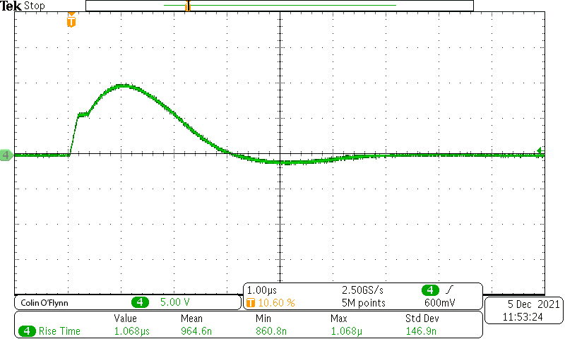

* Proto rev3: 00010: Gate drive (measured on pins of package), using 5 ohm series on T2 output, no shunt. C5 missing (100n):

   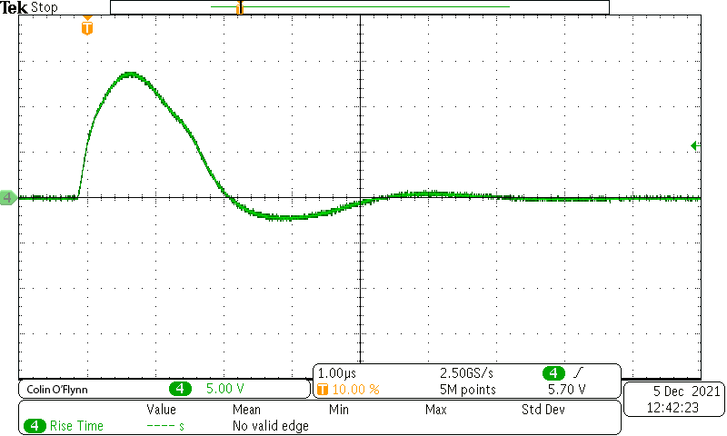

**Proto rev3: Replaced C5. Replaced T2 as pads ripped off (oops).**

* Proto rev3: 00011: Gate drive (measured on pins of package), using 5 ohm series on T2 output, no shunt resistor (R9):

   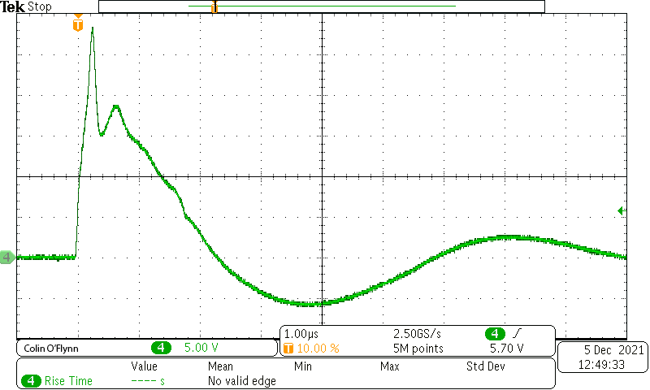

* Proto rev3: 00012: Gate drive (measured on pins of package), using 10 ohm series on T2 output, no shunt resistor (R9):

   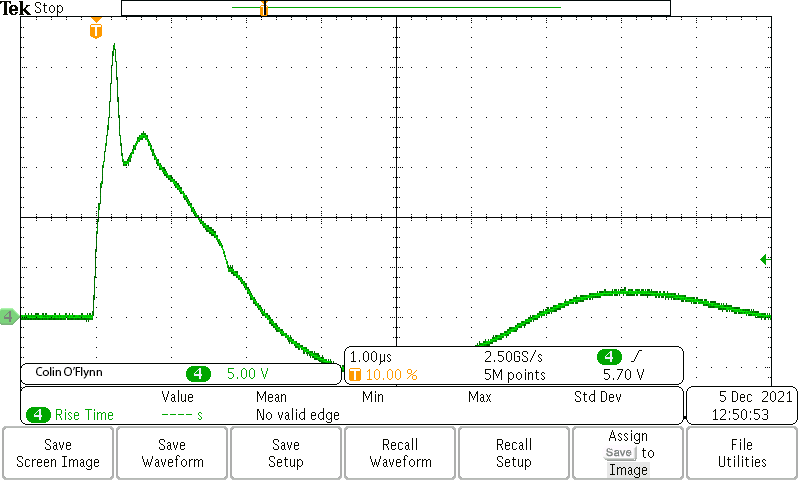

Proto rev3: 00013 - dupe of 12 (saved twice by accident)

* Proto rev3: 00014: Gate drive (measured on pins of package), using 10 ohm series on T2 output, 22k shunt resistor (R9):

   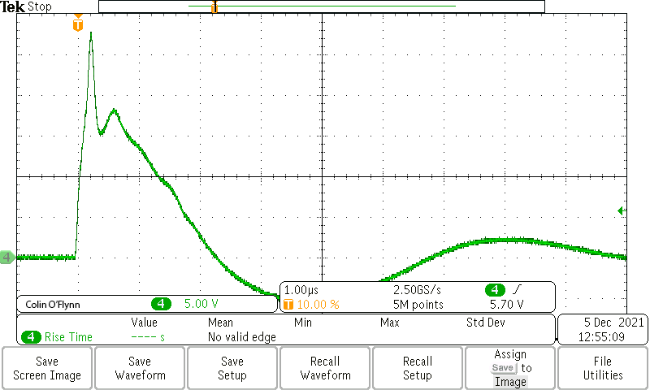

* Proto rev3: 00015: Gate drive (measured on pins of package), using 10 ohm series on T2 output, 2k shunt resistor (R9):
   
   

* Proto rev3: 00016 - dupe of 15 (saved twice by accident):

   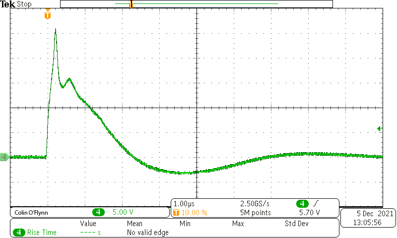

Note the following are performed with "rev2" prototype:

* Proto rev2: 00017: Gate drive (measured on pins of package), using PDZ16BGWJ + 10 ohm series on T2 output, 2k shunt resistor (R9):

   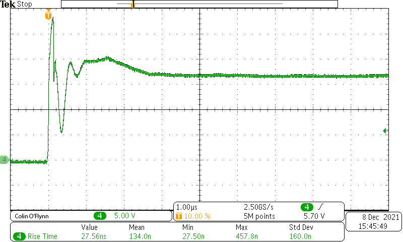

* Proto rev2: 00018: Gate drive (measured on pins of package), using MM3Z18VB + 10 ohm series on T2 output, 2k shunt resistor (R9):
   
   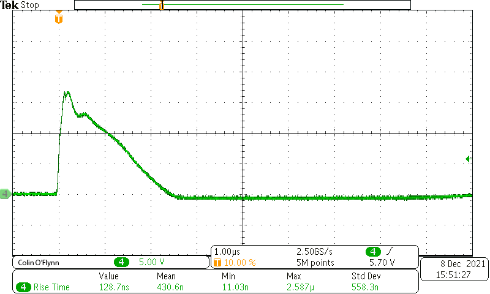

This was the "final" selection of parts. MM3Z18VB as Zener/TVS to limit gate voltage, 10 ohm series, 2K shunt. The MM3Z18VB seemed to safely limit
the gate drive in the required speed, so less (no?) chance of gate blowing up.

## Stress Testing