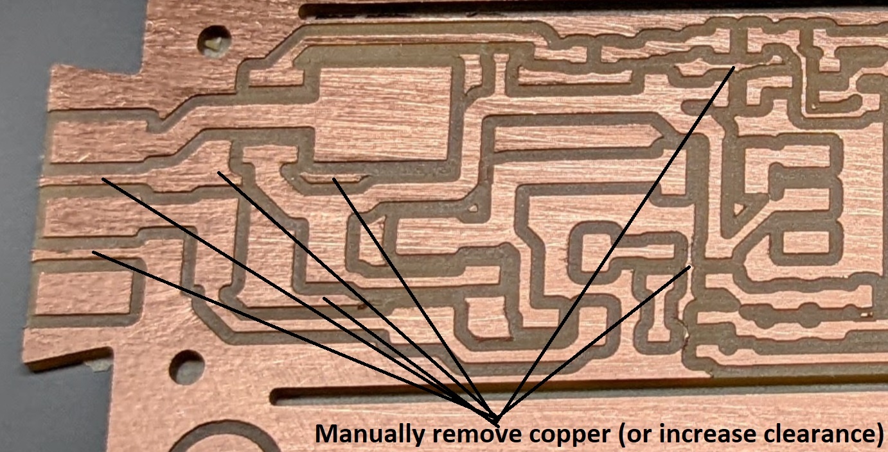
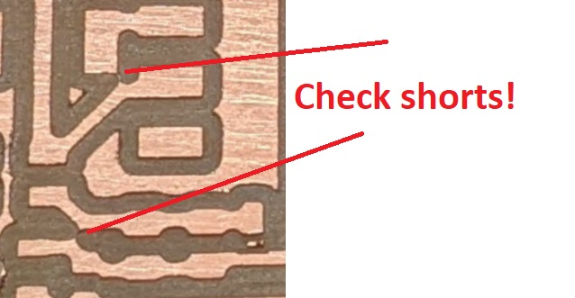
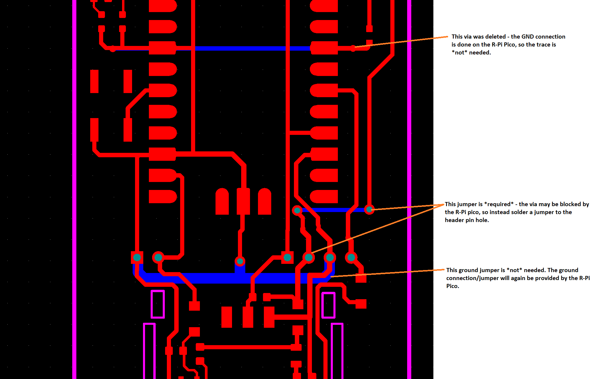

# Bantam Optimized Files

## Settings

## Results

The result out of the mill will look something like this:

## Manual Edits

You should remove a bunch of the copper (or increase the settings when you mill):

Watch out for shorts in a few problem areas:

## Jumper

There is one *required* jumper, shown here:

The GND connections will go via the R-Pi Pico, so there is no jumper required, provided you solder all the connected pins on the R-Pi Pico!