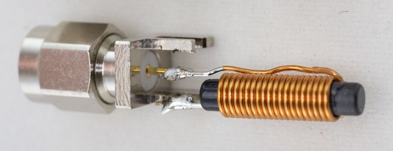
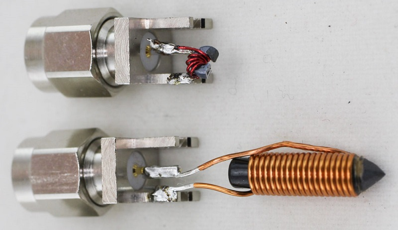
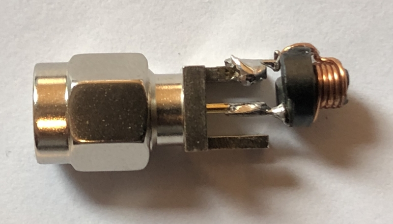
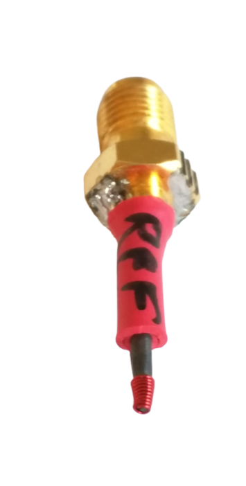

# Building Injection Tips

The injection tips are a key part of the usage
of your EMFi tool. This page includes some
examples and tips for when you go to build
your EM tip.

Typically the design of the tips is wire wrapped
around a ferrite core. The core helps
concentrate the magnetic field, up to a factor 2/3, but isn't
required to be present.

## Ferrite Cores

Ferrite cores can be purchased off the shelf
from electronics distributors. You can often
search for "rods" for example. Fair-Rite types 78 and 61 ferrites are well suited and a reference for fault injection. The ferrite diameter is also ideal because it can vary from 750µm to several mm. 

### Shaping Ferrite Cores

Ferrite cores can be shaped with a wet grinding
wheel. These are typically used as knife
sharpeners. The following example one was
purchased from Busy Bee Tools in Canada 
(similar to Harbour Freight in US), part number
CT191:

This can be especially useful for shortening
cores. To do this:

1. Cut or break the core with pliers.
2. Use the wet wheel to flaten off the broken end.

## SMA Adapters

Various SMA connectors can be used to adapt to
the SMA connector. For example:

* CONSMA013.062 is used in several examples below. It's an edge-mount male connector.

## Various Examples

### Built Using Inductors

Ferrite-core inductors are common parts, and save you from winding your own coils.

#### Coil Craft

The following was built using `PCV-0-472-03L` inductor. This ferrite has a 'hollow core', but
still seems effective for F-I purposes:

#### Würth Elektronik

The following is a smaller inductor, Wurth `744710603` (available on Digi-Key):

You need to unwind a wrapping to connect to the SMA. I'd consider trying this coil with less windings
as well (unwrap more windings, but keep the windings as close to the 'active' end as possible).

The following shows the Wurth `744710603` shaped, along with a small ferrite toroid (`35T0119-00P`):

Alternatively you can also try experimenting with [radial leaded wire wound inductors](https://www.we-online.com/catalog/en/WE-TI#/articles/WE-TI-6065).
Pictured is a modified `744779068` inductor that has the top ferrite cover and a few windings removed.

### Home made probe
#### Conical probe
The following is an example of conical probe with a base diameter of 1.5mm. It is made up of about ten contiguous turns. The average diameter of the probe being 1500µm, it is optimal when the distance with the circuit is 500µm. The ideal is to have a probe radius R=sqrt(2)*z, where z is the distance between the target and the probe. (See "New probe design
for hardware characterization by ElectroMagnetic Fault Injection" by C. Gaine et. al.)

#### Precise probe
The following is an example of precise probe with a diameter of 750µmm. It is made up of about 5 contiguous turns, with a diameter of the wire of 40µm. This type of probe can be used where it is necessary to have precise probes, such as SoC.

#### Long slanted ferrite

The following is an example of doing something funky with a ferrite core:

Interestingly note that despite the excessive length of the ferrite, it *still* injects faults.
The strength is lower than with a more sane coil setup, but it shows that the ferrite couples
the energy well.

### Toroid probe
A simple toroid core can be cut in half easily, the following photo shows a roughly cut (with 
side cutters) core. This shows that even without a wet grinder you can still have fun! The
wire used is AWG30 magnet wire.

