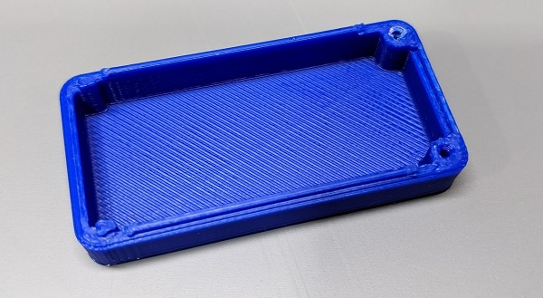

# Protective Shield

A protective shield is required over the high voltage section of the PCB.

## Hammond 1551BTRD Shield

The shield is based on half of the Hammond 1551BTRD plastic enclosure. This enclosure is translucent red which gives
you the cool looking shield! The following should all fit exactly the same:

* 1551BTRD (Translucent red)
* 1551BCLR (Clear)
* 1551BTSK (Translucent smoke)
* 1551BBK (Black, opaque)
* 1551BGY (Grey, opaque)

The first three give some clear/transparent option.

### Cutting Screws

The provided screws are #2 screws, but are too long for just half of the enclosure. Using a heavy pair of side cutters
(such as ones in the middle of pliers) is sufficient to cut the screws in half.

## 3D Printed Version

A modified version of the Hammond enclosure file is available if you need, which will end up looking like this:

Because of the very low cost of the 1551BTRD Hammond enclosure ($3 and it includes the screws) it is suggested to just buy
the real one! But to ensure you don't get stuck without one due to stock issues, this 3D file is provided. Note the 3D file
is derived from the Hammond enclosure `STP` file, meaning this is *not covered by the open source license*. Use at your
own (legal) risk.

You'll need a set of #2 screws, or just use some hot glue / epoxy to keep the shield attached. The smaller "legs" tend to
not print to the correct size, so you can just cut them off with side cutters if they don't fit into the PCB.

